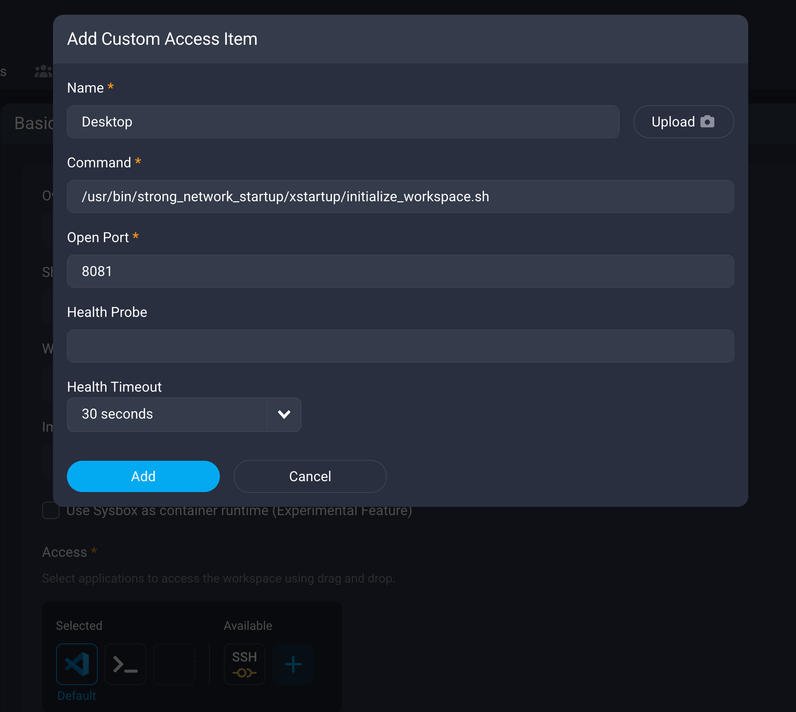

## Debian GUI Image

This page will cover the basic information and how to start using the debian image to have a full graphical desktop environment.

## Instructions

There are two recommended ways of using the GUI mode in the SDS Platform:

### As a Custom Access Item

1. Create/Edit a workspace using the image
2. Click the "+" button on the workspace wizard -> Basic Info -> Access menu
3. In the Add Custom Access Item modal define:
   - Name: As preferred
   - Port: 8081. It's where noVNC will be running
   - Command: ```/usr/bin/strong_network_startup/xstartup/initialize_workspace.sh```



4. Save the wizard
5. Open the desktop from the access item by clicking on it

### As a Workspace App

1. Create a workspace using the image
2. Expose port 8081 as a workspace app
3. Start the workspace and run the following command in the terminal to start the no VNC client:

```
/usr/bin/strong_network_startup/xstartup/initialize_workspace.sh
```

4. Open the workspace app, you should see your desktop.

To automatize this procedure you may include the previous command in the startup script and create a workspace template with a workspace app already created exposing the 8081 port.
