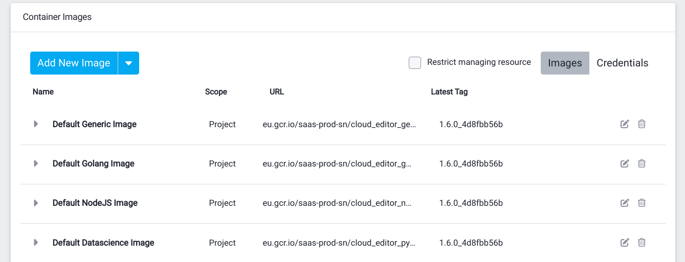

Need help? Email support@strong.network

## What's in This Repository?

This repository is a collection of docker files and scripts that are used to build and deploy workspace images to use with the Virtual Workspace Infastructure (VWI) by Strong Network. The files fulfill several requirements that allow a project owner to import them as resources.



## Provided Environments

These container images cover typical environment needs to develop in languages such as nodejs, python, golang or java, both for back-end and front-end development. You can customize them to fullfil your personal needs. Note that these containers can be updated as well in the VWI by using startup scripts.

## IDE Compatibility

Images built with the provided docker files can be used with Visual Studio Code and the terminal (vim, emacs, etcl) without the need to embed the IDE as part of the image.

## How to build the images

The base image for all of the provided images can be found in the base folder and can be built by running the command:

```bash
make base_image
```

Commands for all of the images can be found in the provided make file and includes commands such as:

```bash
make nodejs_image
make gui_debian
```

To build all of the provided images:

```bash
make all
```

## Docker hub URL

https://hub.docker.com/u/strongnetwork

## Building a Custom Image

You are free to build your own workspace image instead of using the provided ones. When you add a custom image through the web console, Strong Network runs an automated compatibility check against it. The image is only marked as ready to use once this check passes; otherwise it is flagged as *not compatible with the workspace infrastructure*.

### Minimum requirements

Every custom image **must** satisfy the following requirements, or the compatibility check will fail:

1. **`git` is installed** and available on the `PATH`.
2. **`git-lfs` is installed** and available on the `PATH` (run `git lfs install` when building the image).
3. **An SSH client is installed** — the `ssh` command must be available on the `PATH` (for example, the `openssh-client` package on Debian/Ubuntu).
4. **A user named `developer` with UID `1000`** exists, has `/home/developer` as its home directory, and uses `/bin/bash` as its login shell.
5. **The directory `/usr/bin/strong_network_startup` exists** and is writable by the `developer` user. This is where Strong Network stages the startup scripts it injects into the workspace.

The image should run as the `developer` user (`USER 1000`) with `/home/developer` as its working directory.

### Minimal example

The following Dockerfile is a minimal image that satisfies every requirement above:

```Dockerfile
FROM ubuntu:24.04

ENV SHELL=/bin/bash
ENV LANG=C.UTF-8
ENV PATH=/usr/local/sbin:/usr/local/bin:/usr/sbin:/usr/bin:/sbin:/bin

RUN apt-get update && \
    apt-get -y upgrade && \
    apt-get install -y --no-install-recommends ca-certificates git git-lfs openssh-client sudo && \
    git lfs install --system && \
    # only needed when the base image already has UID 1000 occupied.
    userdel -r ubuntu && \
    useradd --uid 1000 --create-home --shell /bin/bash developer && \
    echo 'developer ALL=(ALL) NOPASSWD:ALL' >> /etc/sudoers.d/nopasswd && \
    mkdir -p /usr/bin/strong_network_startup && \
    chown developer:developer /usr/bin/strong_network_startup && \
    rm -rf /var/lib/apt/lists/*

USER 1000
WORKDIR /home/developer
```

Start from this image (or from one of the provided base images) and add whatever tools, runtimes, and packages your project needs on top of it.

### A note on installing Docker

If your workflow needs Docker inside the workspace, install **only the Docker client (CLI)** in your image — **do not install the Docker daemon (`dockerd`) or run it inside the image**. The Virtual Workspace Infrastructure (VWI) provides the Docker engine to the workspace, so a daemon bundled in the image is unnecessary, increases the image size, and can conflict with the runtime environment.

On Debian/Ubuntu, install the standalone client rather than the full `docker-ce` / `docker.io` package (which pulls in `dockerd` and `containerd`). For example, download the static Docker client binary and place just the `docker` binary on the `PATH`:

```Dockerfile
RUN mkdir -p /usr/local/lib/docker/cli-plugins && \
    wget -q https://download.docker.com/linux/static/stable/x86_64/docker-29.6.2.tgz -O /tmp/docker.tar.gz && \
    tar -xzf /tmp/docker.tar.gz --strip-components=1 -C /usr/bin docker/docker && \
    rm /tmp/docker.tar.gz && \
    wget -q https://github.com/docker/buildx/releases/download/v0.35.0/buildx-v0.35.0.linux-amd64 \
        -O /usr/local/lib/docker/cli-plugins/docker-buildx && \
    chmod +x /usr/local/lib/docker/cli-plugins/docker-buildx && \
    wget -q https://github.com/docker/compose/releases/download/v5.3.1/docker-compose-linux-x86_64 \
        -O /usr/local/bin/docker-compose && \
    chmod +x /usr/local/bin/docker-compose
```
