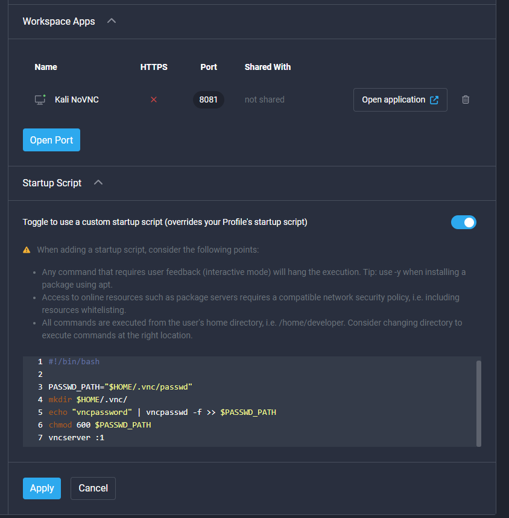

## GUI Development with Kali Linux image

This page will cover the basic information and how to start using the https://hub.docker.com/r/strongnetwork/generic_kali_linux image to have a full graphical desktop environment. The source docker can be found here: https://github.com/strong-network/images/blob/main/no_vnc/Dockerfile  

## Instructions
1. Create a workspace using the image
2. Add the following startup script:
```
PASSWD_PATH="$HOME/.vnc/passwd"
mkdir $HOME/.vnc/
echo "vncpassword" | vncpasswd -f >> $PASSWD_PATH
chmod 600 $PASSWD_PATH
vncserver :1
```
3. Expose port 8081 as a workspace app
blob:



4. Start the workspace and run the following command in the terminal to start the no VNC client:
``` 
/usr/share/novnc/utils/novnc_proxy --listen 8081 --vnc localhost:5901 & 
```

5. Open the workspace app, the password is "vncpassword" which can be changed in the startup script
6. Full desktop environment will be opened
